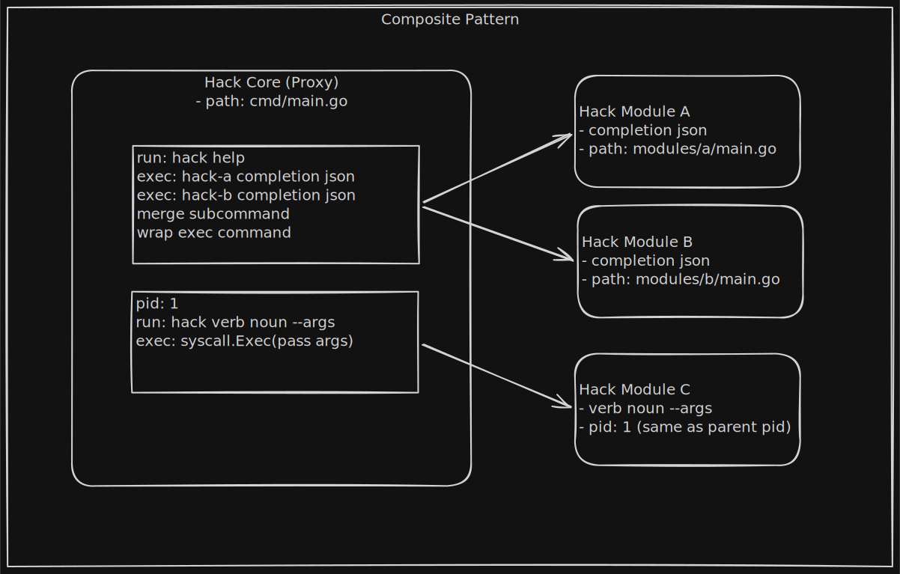
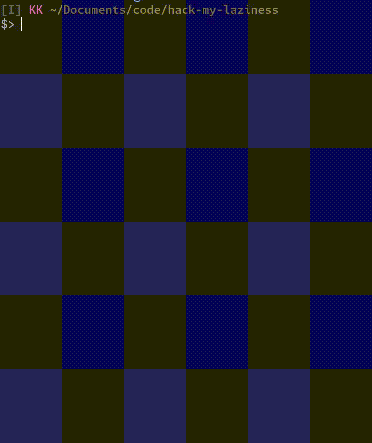

# Hack My Laziness

## Why?

Are you a lazy person? Because I am.

I use the terminal every day on Linux.
I've memorized so many tools and commands.
One day, I asked myself:
"Why do I have to remember all of them?"
"Why don't I have a single tool?"

So, `hack` was born.

I designed the commands like kubectl: `hack verb noun`.

For example:

- `hack calc '1+1'` → `2`
- `hack ask "what is this?" --model=claude` → `This thing is blah blah`
- `hack get "https://api.myexample.com"` → `{"data":"example"}`
- `hack run http --config=stub.yaml --port=8000` → starts a stub server with routes from the yaml file

## High Level Design

## Preview My Idea

## Expected Features

- [ ] time
- [ ] calculator
- [ ] http
- [ ] stub server
- [ ] proxy
- [ ] encode / decode
